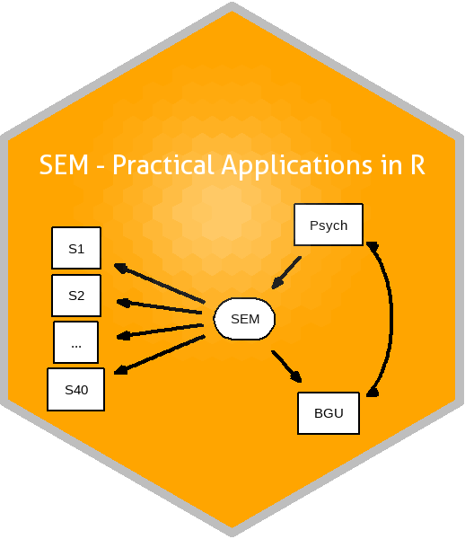

# Structural Equation Modeling foR Psychologists

*Last updated 2020-05-10.*

This Github repo contains all lesson files used in the graduate-level
course: *Structural Equation Modeling foR Psychologists - Practical
Applications in R*, taught at Ben-Gurion University on the Negev (spring
2019 semester). This course assumes basic competence in R (importing,
regression modeling, plotting, etc.), a long the lines of the
prerequisite course, [*Advanced Research Methods foR
Psychologists*](https://github.com/mattansb/Advanced-Research-Methods-foR-Psychologists).

The goal is to impart students with the basic tools to construct,
evaluate and compare **Structural Equation Models (SEM; w/ plots), using
[`lavaan`](http://lavaan.ugent.be/)**.

**Notes:**

  - This repo contains only materials relating to *Practical
    Applications in R*, and does not contain any theoretical or
    introductory materials.  
  - Please note that some code does not work *on purpose*, to force
    students to learn to debug.

## Setup

You will need:

1.  A fresh installation of [**`R`**](https://cran.r-project.org/)
    (preferably version 3.6 or above).
2.  [RStudio](https://www.rstudio.com/products/rstudio/download/)
    (optional - but I recommend using an IDE).
3.  The following packages, listed by lesson:

| Lesson                                                                                              | Packages                                                                                                                                                                                                                                                                                                                                                                                                                                                               |
| --------------------------------------------------------------------------------------------------- | ---------------------------------------------------------------------------------------------------------------------------------------------------------------------------------------------------------------------------------------------------------------------------------------------------------------------------------------------------------------------------------------------------------------------------------------------------------------------- |
| [01 path analysis](/01%20path%20analysis)                                                           | [`lavaan`](https://CRAN.R-project.org/package=lavaan), [`semPlot`](https://CRAN.R-project.org/package=semPlot), [`lavaanPlot`](https://CRAN.R-project.org/package=lavaanPlot)                                                                                                                                                                                                                                                                                          |
| [02 latent variables and hypothesis testing](/02%20latent%20variables%20and%20hypothesis%20testing) | [`lavaan`](https://CRAN.R-project.org/package=lavaan), [`semTools`](https://CRAN.R-project.org/package=semTools), [`dplyr`](https://CRAN.R-project.org/package=dplyr), [`semPlot`](https://CRAN.R-project.org/package=semPlot), [`psychTools`](https://CRAN.R-project.org/package=psychTools), [`bayestestR`](https://CRAN.R-project.org/package=bayestestR)                                                                                                           |
| [03 cross-lagged panel model](/03%20cross-lagged%20panel%20model)                                   | [`lavaan`](https://CRAN.R-project.org/package=lavaan), [`semPlot`](https://CRAN.R-project.org/package=semPlot), [`bayestestR`](https://CRAN.R-project.org/package=bayestestR)                                                                                                                                                                                                                                                                                          |
| [04 multiple group analysis](/04%20multiple%20group%20analysis)                                     | [`lavaan`](https://CRAN.R-project.org/package=lavaan), [`bayestestR`](https://CRAN.R-project.org/package=bayestestR), [`semPlot`](https://CRAN.R-project.org/package=semPlot), [`semTools`](https://CRAN.R-project.org/package=semTools)                                                                                                                                                                                                                               |
| [05 latent growth curve modeling](/05%20latent%20growth%20curve%20modeling)                         | [`lavaan`](https://CRAN.R-project.org/package=lavaan), [`semPlot`](https://CRAN.R-project.org/package=semPlot)                                                                                                                                                                                                                                                                                                                                                         |
| [06 assumption checks](/06%20assumption%20checks)                                                   | [`lavaan`](https://CRAN.R-project.org/package=lavaan), [`semTools`](https://CRAN.R-project.org/package=semTools), [`car`](https://CRAN.R-project.org/package=car)                                                                                                                                                                                                                                                                                                      |
| [07 moderation in lavaan](/07%20moderation%20in%20lavaan)                                           | [`lavaan`](https://CRAN.R-project.org/package=lavaan), [`semTools`](https://CRAN.R-project.org/package=semTools)                                                                                                                                                                                                                                                                                                                                                       |
| [08 EFA](/08%20EFA)                                                                                 | [`parameters`](https://CRAN.R-project.org/package=parameters), [`psych`](https://CRAN.R-project.org/package=psych), [`lavaan`](https://CRAN.R-project.org/package=lavaan), [`semPlot`](https://CRAN.R-project.org/package=semPlot), [`dplyr`](https://CRAN.R-project.org/package=dplyr), [`tidyr`](https://CRAN.R-project.org/package=tidyr), [`psychTools`](https://CRAN.R-project.org/package=psychTools), [`nFactors`](https://CRAN.R-project.org/package=nFactors) |

You can install all the packages used by running:

    # in alphabetical order:

    pkgs <- c(
      "bayestestR", "car", "dplyr", "lavaan", "lavaanPlot", "nFactors",
      "parameters", "psych", "psychTools", "semPlot", "semTools", "tidyr"
    )

    install.packages(pkgs, dependencies = TRUE)

The package versions used here:

    ##    bayestestR           car         dplyr        lavaan    lavaanPlot 
    ##     "0.6.0.1"       "3.0-7" "0.8.99.9002"       "0.6-5"       "0.5.1" 
    ##      nFactors    parameters         psych    psychTools       semPlot 
    ##       "2.4.1"     "0.6.1.1"   "1.9.12.31"      "1.9.12"       "1.1.2" 
    ##      semTools         tidyr 
    ##   "0.5-2.920"       "1.0.2"

## Other Useful Resources

  - [`lavaan` toutorials](http://lavaan.ugent.be/tutorial/index.html).  
  - Sacha Epskamp’s [online course](http://sachaepskamp.com/SEM2020) and
    [YouTube
    lectures](https://www.youtube.com/playlist?list=PLliBbGBc5nn3m8bXQ4CmOep3UmQ_5tVlC).  
  - Michael Hallquist’s
    [course](https://psu-psychology.github.io/psy-597-SEM/).
