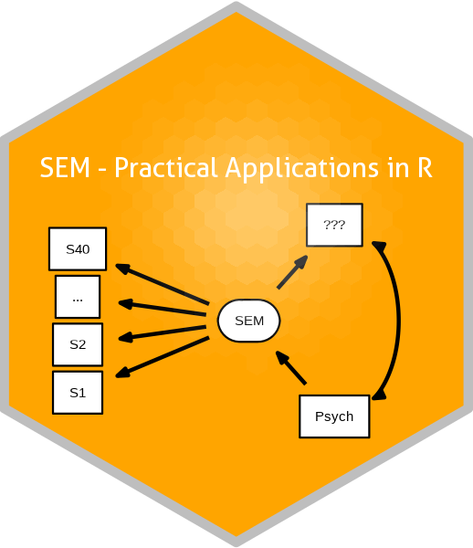

# Structural Equation Modeling foR Psychologists

  

*Last updated 2023-06-03.*

This Github repo contains all lesson files for *SEM - Practical
Applications in R*. The goal is to impart students with the basic tools
to construct, evaluate and compare **Structural Equation Models (SEM; w/
plots), using [`lavaan`](http://lavaan.ugent.be/)**.

These topics were taught in the graduate-level course ***Structural
Equation Modeling*** (Psych Dep., Ben-Gurion University of the Negev).
This course assumes basic competence in R (importing, regression
modeling, plotting, etc.), along the lines of [*Practical Applications
in R for
Psychologists*](https://github.com/mattansb/Practical-Applications-in-R-for-Psychologists).

**Notes:**

- This repo contains only materials relating to *Practical Applications
  in R*, and does not contain any theoretical or introductory
  materials.  
- Please note that some code does not work *on purpose*, to force
  students to learn to debug.

## Setup

You will need:

1.  A fresh installation of [**`R`**](https://cran.r-project.org/)
    (preferably version 4.0 or above).
2.  [RStudio IDE](https://www.rstudio.com/products/rstudio/download/)
    (optional, but recommended).
3.  The following packages, listed by lesson:

| Lesson                                                                                            | Packages                                                                                                                                                                                                                                                                                                                                                                                                                                                                                                                                                                                                                   |
|---------------------------------------------------------------------------------------------------|----------------------------------------------------------------------------------------------------------------------------------------------------------------------------------------------------------------------------------------------------------------------------------------------------------------------------------------------------------------------------------------------------------------------------------------------------------------------------------------------------------------------------------------------------------------------------------------------------------------------------|
| [01 path analysis](/01%20path%20analysis)                                                         | [`lavaan`](https://CRAN.R-project.org/package=lavaan), [`tidySEM`](https://CRAN.R-project.org/package=tidySEM), [`dplyr`](https://CRAN.R-project.org/package=dplyr), [`ggplot2`](https://CRAN.R-project.org/package=ggplot2)                                                                                                                                                                                                                                                                                                                                                                                               |
| [02 CFA](/02%20CFA)                                                                               | [`lavaan`](https://CRAN.R-project.org/package=lavaan), [`tidySEM`](https://CRAN.R-project.org/package=tidySEM), [`dplyr`](https://CRAN.R-project.org/package=dplyr), [`semTools`](https://CRAN.R-project.org/package=semTools), [`psychTools`](https://CRAN.R-project.org/package=psychTools), [`patchwork`](https://CRAN.R-project.org/package=patchwork)                                                                                                                                                                                                                                                                 |
| [03 SEM with CLPM](/03%20SEM%20with%20CLPM)                                                       | [`lavaan`](https://CRAN.R-project.org/package=lavaan), [`tidySEM`](https://CRAN.R-project.org/package=tidySEM), [`magrittr`](https://CRAN.R-project.org/package=magrittr), [`bayestestR`](https://CRAN.R-project.org/package=bayestestR)                                                                                                                                                                                                                                                                                                                                                                                   |
| [04 multiple group analysis](/04%20multiple%20group%20analysis)                                   | [`lavaan`](https://CRAN.R-project.org/package=lavaan), [`tidySEM`](https://CRAN.R-project.org/package=tidySEM), [`bayestestR`](https://CRAN.R-project.org/package=bayestestR), [`semTools`](https://CRAN.R-project.org/package=semTools)                                                                                                                                                                                                                                                                                                                                                                                   |
| [05 (mediated) moderation](/05%20(mediated)%20moderation)                                         | [`lavaan`](https://CRAN.R-project.org/package=lavaan), [`semTools`](https://CRAN.R-project.org/package=semTools)                                                                                                                                                                                                                                                                                                                                                                                                                                                                                                           |
| [06 latent growth curve + multi-level SEM](/06%20latent%20growth%20curve%20+%20multi-level%20SEM) | [`lavaan`](https://CRAN.R-project.org/package=lavaan), [`tidySEM`](https://CRAN.R-project.org/package=tidySEM)                                                                                                                                                                                                                                                                                                                                                                                                                                                                                                             |
| [07 assumption checks](/07%20assumption%20checks)                                                 | [`lavaan`](https://CRAN.R-project.org/package=lavaan), [`semTools`](https://CRAN.R-project.org/package=semTools), [`MVN`](https://CRAN.R-project.org/package=MVN), [`car`](https://CRAN.R-project.org/package=car)                                                                                                                                                                                                                                                                                                                                                                                                         |
| [08 EFA](/08%20EFA)                                                                               | [`lavaan`](https://CRAN.R-project.org/package=lavaan), [`psych`](https://CRAN.R-project.org/package=psych), [`tidyverse`](https://CRAN.R-project.org/package=tidyverse), [`recipes`](https://CRAN.R-project.org/package=recipes), [`parameters`](https://CRAN.R-project.org/package=parameters), [`factoextra`](https://CRAN.R-project.org/package=factoextra), [`performance`](https://CRAN.R-project.org/package=performance), [`nFactors`](https://CRAN.R-project.org/package=nFactors), [`GPArotation`](https://CRAN.R-project.org/package=GPArotation), [`psychTools`](https://CRAN.R-project.org/package=psychTools) |

You can install all the packages used by running:

    # in alphabetical order:

    pkgs <-
      c(
        "bayestestR", "car", "dplyr", "factoextra", "ggplot2", "GPArotation",
        "lavaan", "magrittr", "MVN", "nFactors", "parameters", "patchwork",
        "performance", "psych", "psychTools", "recipes", "semTools",
        "tidySEM", "tidyverse"
      )

    install.packages(pkgs, dependencies = TRUE)

<i>Package Versions</i>

The package versions used here:

- `bayestestR` 0.13.1 (*CRAN*)
- `car` 3.1-2 (*CRAN*)
- `dplyr` 1.1.1 (*CRAN*)
- `factoextra` 1.0.7 (*CRAN*)
- `ggplot2` 3.4.2 (*CRAN*)
- `GPArotation` 2023.3-1 (*CRAN*)
- `lavaan` 0.6-15 (*CRAN*)
- `magrittr` 2.0.3 (*CRAN*)
- `MVN` 5.9 (*CRAN*)
- `nFactors` 2.4.1.1 (*CRAN*)
- `parameters` 0.21.0 (*CRAN*)
- `patchwork` 1.1.2 (*CRAN*)
- `performance` 0.10.3 (*CRAN*)
- `psych` 2.3.3 (*CRAN*)
- `psychTools` 2.3.3 (*CRAN*)
- `recipes` 1.0.5 (*CRAN*)
- `semTools` 0.5-6.917 (*Dev*)
- `tidySEM` 0.2.3 (*CRAN*)
- `tidyverse` 2.0.0 (*CRAN*)

## Other Useful Resources

### Other Courses

In addition to [`lavaan`’s
toutorials](http://lavaan.ugent.be/tutorial/index.html), you might find
the following online courses useful:

- Sacha Epskamp’s [online course](http://sachaepskamp.com/SEM2020) and
  [YouTube
  lectures](https://www.youtube.com/playlist?list=PLliBbGBc5nn3m8bXQ4CmOep3UmQ_5tVlC).
  - See also the [`psychonetrics`](http://psychonetrics.org/) package
    for psychometric network modeling.  
- Michael Hallquist’s
  [course](https://psu-psychology.github.io/psy-597-SEM/).

### Selected Quantitude (podcast) Episods

These are selected episodes from the [Quantitude
podcast](https://quantitudepod.org/) related to SEM:

- [S2E08: **Mediation** and the Art of Squid
  Spleening](https://www.buzzsprout.com/639103/5817541-s2e08-mediation-and-the-art-of-squid-spleening)
- [S2E24: The **Equivalent Models**
  Problem](https://www.buzzsprout.com/639103/7983649-s2e24-the-equivalent-models-problem)
- [S2E26: MLM vs. **SEM**: Opportunities for
  Growth](https://www.buzzsprout.com/639103/8084578-s2e26-mlm-vs-sem-opportunities-for-growth)
